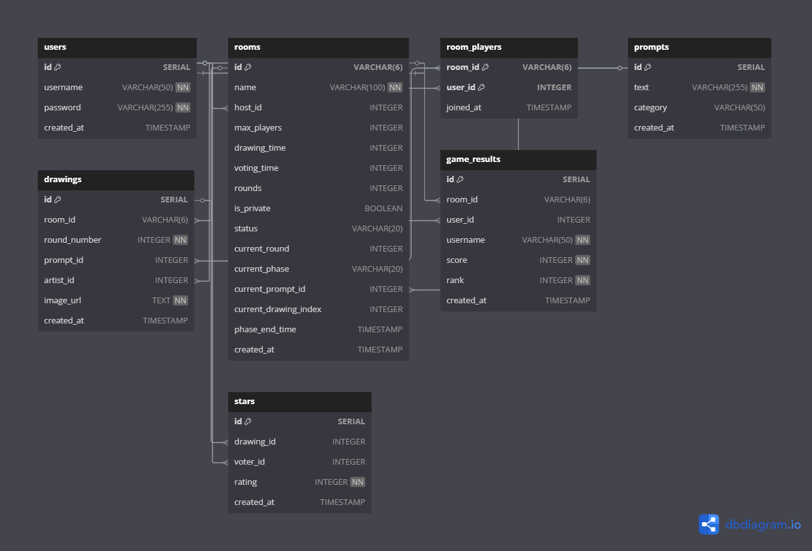
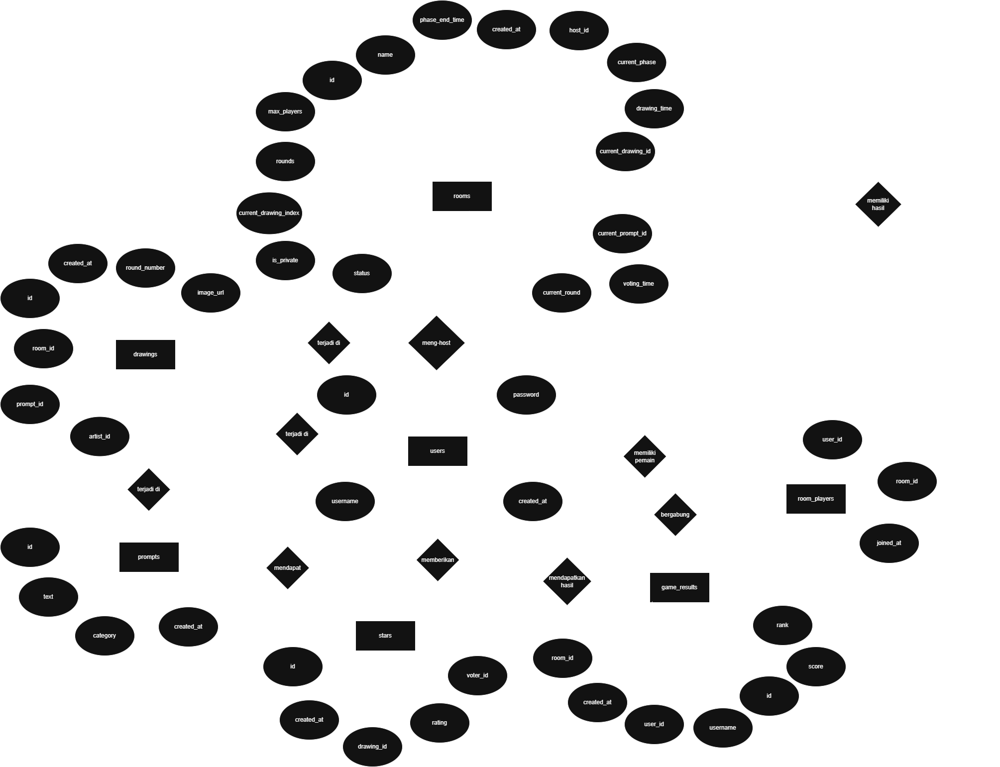

# 🎨 **Draw Battle!** 🖌️

<div align="center">
  
  <p><em>The Draw Battle homepage featuring interactive UI elements and colorful design</em></p>
</div>

<div align="center">
  <p><strong>Challenge your friends to drawing battles, vote on each other's artwork, and claim victory!</strong></p>
  
  <p>
    <a href="#-features"><strong>Features</strong></a> •
    <a href="#-architecture"><strong>Architecture</strong></a> •
    <a href="#-technical-overview"><strong>Technical Overview</strong></a> •
    <a href="#-installation"><strong>Installation</strong></a> •
    <a href="#-screenshots"><strong>Screenshots</strong></a> •
    <a href="#-team"><strong>Team</strong></a>
  </p>

  
  
  
  
  
  
  
</div>

## 📋 About

**Draw Battle** is a real-time multiplayer drawing game that challenges players' creativity and artistic skills. Players compete by creating drawings based on random prompts, then vote on each other's artwork. The highest-rated drawing wins the round, and players earn points to climb the leaderboard.

<div align="center">
  
  <p><em>Application flow diagram showing the game's core mechanics and user journey</em></p>
</div>

## ✨ Features

### Core Gameplay
- **🎭 Create & Join Rooms**: Create custom game rooms or join existing ones
- **👥 Multiplayer Competition**: Play with friends or random opponents
- **🖼️ Drawing Challenges**: Create artwork based on randomly generated prompts
- **⭐ Voting System**: Rate other players' drawings from 1 to 5 stars
- **🏆 Leaderboards**: Track your progress and compete for the top spot

### User Experience
- **🔐 Authentication**: Secure user accounts with login/registration
- **🌓 Theme Toggle**: Light and dark mode support
- **📱 Responsive Design**: Works on mobile, tablet, and desktop devices
- **🎨 User Profiles**: Customize your profile and view your game history
- **⚡ Real-time Updates**: Instant game state updates using Websockets

## 🏗️ Architecture

The Draw Battle application follows a modern web architecture with a clear separation between frontend and backend components.

<div align="center">
  
  <p><em>UML class diagram showing the application's component structure and relationships</em></p>
</div>

### Database Design

The database schema is designed to efficiently store user data, game rooms, drawings, and voting results.

<div align="center">
  
  <p><em>Entity Relationship Diagram illustrating the database schema with tables for users, rooms, drawings, and votes</em></p>
</div>

## 🔧 Technical Overview

### Frontend (React + Vite)
The frontend is built with React and Vite, featuring:
- **Component Architecture**: Modular and reusable UI components
- **State Management**: Using React Context API for global state
- **Canvas Drawing**: Interactive drawing canvas with multiple tools
- **Animation**: Smooth transitions and UI effects with Framer Motion
- **Styling**: Modern UI with TailwindCSS and custom CSS

### Backend (Node.js + Express)
The backend provides RESTful API endpoints and real-time capabilities:
- **Authentication**: JWT-based user authentication
- **Game Logic**: Room creation, player management, game state transitions
- **Image Processing**: Drawing storage and retrieval with Cloudinary
- **Data Access**: MySQL database integration with connection pooling
- **API Security**: Protected routes with middleware validation

### Directory Structure
```
DrawBattle/
├── frontend/                # React frontend application
│   ├── src/
│   │   ├── assets/          # Images and static resources
│   │   ├── components/      # Reusable UI components
│   │   ├── contexts/        # React Context providers
│   │   ├── pages/           # Application pages/screens
│   │   ├── services/        # API integration and services
│   │   └── styles/          # Global CSS and theme styles
│   └── ...
├── backend/                 # Node.js backend application
│   ├── config/              # Database and service configurations
│   ├── middleware/          # Express middleware functions
│   ├── migrations/          # Database migration scripts
│   ├── routes/              # API route definitions
│   └── ...
└── dokumentasi/            # Project documentation resources
```

## 🚀 Installation

### Prerequisites
- Node.js (v14 or higher)
- MySQL (v5.7 or higher)
- npm or yarn

### Setting Up the Frontend
```bash
# Navigate to frontend directory
cd frontend

# Install dependencies
npm install

# Start development server
npm run dev
```

### Setting Up the Backend
```bash
# Navigate to backend directory
cd backend

# Install dependencies
npm install

# Configure environment variables (create .env file)
# See .env.example for required variables

# Initialize database (run schema.sql in MySQL)

# Start server
node server.js
```

## 📸 Screenshots

<div align="center">
  
  <p><em>Progress Checking 1: May 18th, 2025</em></p>
  <br>
  
  <p><em>Progress Checking 2: May 20th, 2025</em></p>
</div>

## 👥 Team

This project was developed as a final project for Database Systems Practicum by:

<div align="center">

| Photo | Name | Student ID | GitHub |
|:-----:|:-----|:----------:|:------:|
|  | Adhi Rajasa Rafif | 2306266943 | [AdhiRajasaRafif02](https://github.com/AdhiRajasaRafif02) |
|  | Adrian Dika Darmawan | 2306250711 | [adriandikad2](https://github.com/adriandikad2) |
|  | Fathan Yazid Satriani | 2306250560 | [IfanFYS](https://github.com/IfanFYS) |
|  | Grace Yunike Margaretha Sitorus | 2306267031 | [graceyunike](https://github.com/graceyunike) |

</div>

---

<div align="center">
  <p>© 2025 Draw Battle Team - Group 23 SBD</p>
</div>
